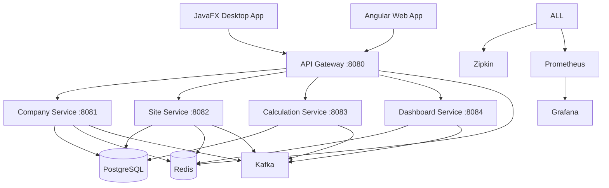

# Docker Container Deployment Guide
## Logistics Platform

This guide covers the complete Docker containerization setup for the Define Company Logistics Platform, including both microservices and JavaFX desktop application.

## 📋 Table of Contents

- [Overview](#overview)
- [Prerequisites](#prerequisites)
- [Architecture](#architecture)
- [Quick Start](#quick-start)
- [Development Environment](#development-environment)
- [Production Deployment](#production-deployment)
- [JavaFX Desktop Application](#javafx-desktop-application)
- [Monitoring and Observability](#monitoring-and-observability)
- [Terraform Infrastructure](#terraform-infrastructure)
- [Troubleshooting](#troubleshooting)

## 🌟 Overview

The logistics platform consists of:

### **Microservices Architecture**
- **API Gateway** (Port 8080) - Public entry point with rate limiting and routing
- **Company Service** (Port 8081) - Company management and registration
- **Site Service** (Port 8082) - Consumption site management
- **Calculation Service** (Port 8083) - Barycenter calculations and logistics algorithms
- **Dashboard Service** (Port 8084) - KPI aggregation and reporting

### **Infrastructure Services**
- **PostgreSQL** - Multi-database setup for microservices
- **Redis** - Caching and session management
- **Apache Kafka + Zookeeper** - Event streaming and messaging
- **Zipkin** - Distributed tracing
- **Prometheus + Grafana** - Metrics and monitoring

### **Desktop Application**
- **JavaFX GUI** - Desktop interface with VNC support for remote access

## 🔧 Prerequisites

### Required Software
```bash
# Core requirements
Docker Engine >= 20.10
Docker Compose >= 2.0
Make (for automation)
Git

# For AWS deployment
AWS CLI >= 2.0
Terraform >= 1.6.0

# For development
Java 17+
Maven 3.8+
Node.js 18+ (for Angular UI)
```

### AWS Setup (for production)
```bash
# Configure AWS credentials
aws configure

# Verify access
aws sts get-caller-identity
```

## 🏗️ Architecture



## 🚀 Quick Start

### 1. Clone and Setup
```bash
git clone <repository>
cd define-company-logistic-place

# Copy environment template
cp env.example .env

# Edit environment variables
vim .env
```

### 2. Start Development Environment
```bash
# Using Make (recommended)
make dev-up

# Or using Docker Compose directly
docker-compose -f docker/docker-compose.microservices.yml up -d
```

### 3. Verify Services
```bash
# Check service health
make health-check

# View logs
make dev-logs

# Check specific service
make dev-logs-service SERVICE=api-gateway
```

### 4. Access Applications
- **API Gateway**: http://localhost:8080
- **Grafana Dashboard**: http://localhost:3000 (admin/admin)
- **Prometheus**: http://localhost:9090
- **Zipkin Tracing**: http://localhost:9411
- **Kafka UI**: http://localhost:8082 (if enabled in dev mode)

## 💻 Development Environment

### Start Development Stack
```bash
make dev-up
```

This starts:
- All microservices with debug ports exposed
- Infrastructure services (PostgreSQL, Redis, Kafka)
- Monitoring stack (Prometheus, Grafana, Zipkin)
- Development tools (pgAdmin, Redis Insight)

### Development Features
- **Hot Reload**: Code changes automatically deployed
- **Debug Ports**: Each service exposes JVM debug port
- **Database Access**: pgAdmin on port 5050
- **Redis GUI**: Redis Insight on port 8001
- **Kafka Management**: Kafka UI on port 8082

### Debug Individual Services
```bash
# Get shell access
make dev-shell SERVICE=company-service

# View real-time logs
make dev-logs-service SERVICE=calculation-service

# Restart specific service
docker-compose -f docker/docker-compose.microservices.yml restart site-service
```

## 🏭 Production Deployment

### Local Production Testing
```bash
# Build optimized images
make build

# Start with production configuration
make prod-up
```

### AWS ECS Deployment

#### 1. Setup Infrastructure
```bash
# Initialize Terraform
make tf-init TF_ENV=prod

# Review planned changes
make tf-plan TF_ENV=prod

# Apply infrastructure
make tf-apply TF_ENV=prod
```

#### 2. Deploy Applications
```bash
# Build, test, and push to ECR
make deploy-prod
```

#### 3. Monitor Deployment
```bash
# Check Terraform outputs
make tf-output TF_ENV=prod

# View ECS service status
aws ecs list-services --cluster logistics-prod
```

### Production Configuration

The production setup includes:
- **Auto Scaling**: CPU and memory-based scaling policies
- **Load Balancing**: Application Load Balancer with health checks
- **Security**: Security groups, IAM roles, encrypted storage
- **Monitoring**: CloudWatch alarms, SNS notifications
- **Backup**: Automated RDS backups, EBS snapshots

## 🖥️ JavaFX Desktop Application

### Build Desktop Application
```bash
make build-desktop
```

### Run Desktop Application

#### Method 1: VNC Access (Remote)
```bash
# Start with VNC server
make run-desktop

# Connect using VNC client
# URL: vnc://localhost:5900
make vnc-info
```

#### Method 2: X11 Forwarding (Linux/Mac)
```bash
# Enable X11 forwarding
xhost +local:

# Run with host display
docker run --rm -it \
  -e DISPLAY=$DISPLAY \
  -v /tmp/.X11-unix:/tmp/.X11-unix:rw \
  logistics/desktop-app:latest
```

#### Method 3: Windows with XLaunch
```bash
# Start XLaunch on Windows
# Then run container
docker run --rm -it \
  -e DISPLAY=host.docker.internal:0 \
  logistics/desktop-app:latest
```

### Desktop Application Features
- **Multi-platform**: Runs on Linux, Windows, macOS
- **Remote Access**: VNC server for remote GUI access
- **Container Integration**: Connects to microservices backend
- **Security**: Non-root user execution

## 📊 Monitoring and Observability

### Grafana Dashboards
Access Grafana at http://localhost:3000
- **Service Overview**: Health, response times, throughput
- **Infrastructure Metrics**: CPU, memory, disk usage
- **Business Metrics**: Custom application metrics
- **Error Tracking**: Error rates and patterns

### Prometheus Metrics
Access Prometheus at http://localhost:9090
- Application metrics from Spring Boot Actuator
- JVM metrics (heap, GC, threads)
- Custom business metrics
- Infrastructure metrics

### Distributed Tracing
Access Zipkin at http://localhost:9411
- End-to-end request tracing
- Service dependency mapping
- Performance bottleneck identification
- Error correlation across services

### Log Aggregation
```bash
# View aggregated logs
make dev-logs

# Service-specific logs
make dev-logs-service SERVICE=api-gateway

# Follow logs in real-time
docker-compose logs -f company-service
```

## ☁️ Terraform Infrastructure

### Infrastructure Components

#### Core Infrastructure
- **VPC**: Multi-AZ virtual private cloud with public/private subnets
- **ECS Cluster**: Fargate cluster for containerized services
- **Application Load Balancer**: HTTP/HTTPS traffic routing
- **ECR Repositories**: Container image storage

#### Security
- **IAM Roles**: Service-specific execution and task roles
- **Security Groups**: Network access control
- **Parameter Store**: Secure configuration management
- **KMS**: Encryption key management

#### Monitoring
- **CloudWatch Logs**: Centralized log aggregation
- **CloudWatch Alarms**: Automated alerting
- **SNS Topics**: Notification delivery
- **X-Ray**: Distributed tracing (optional)

#### Data Layer
- **RDS PostgreSQL**: Managed database with Multi-AZ
- **ElastiCache Redis**: Managed caching layer
- **S3 Buckets**: Object storage for artifacts and backups

### Environment Management

#### Development Environment
```bash
# Deploy development environment
make deploy-dev
```
- Single AZ deployment
- Shared database instance
- Basic monitoring
- Cost-optimized instance types

#### Staging Environment
```bash
# Deploy staging environment
make deploy-staging
```
- Production-like configuration
- Full monitoring enabled
- Load testing capabilities
- Blue-green deployment testing

#### Production Environment
```bash
# Deploy production environment
make deploy-prod
```
- Multi-AZ high availability
- Auto-scaling enabled
- Comprehensive monitoring
- Backup and disaster recovery

## 🔍 Troubleshooting

### Common Issues

#### Services Won't Start
```bash
# Check service dependencies
docker-compose ps

# View service logs
make dev-logs-service SERVICE=problematic-service

# Check resource constraints
docker stats

# Restart services in order
make dev-down && make dev-up
```

#### Database Connection Issues
```bash
# Check PostgreSQL container
docker-compose logs postgres

# Verify database creation
docker-compose exec postgres psql -U logistics -l

# Reset database
docker-compose down -v  # WARNING: Deletes all data
make dev-up
```

#### Memory Issues
```bash
# Check container memory usage
docker stats

# Increase JVM heap size in .env
JAVA_OPTS=-XX:MaxRAMPercentage=50.0

# Or increase container limits in docker-compose.override.yml
```

#### Network Connectivity
```bash
# Test service-to-service communication
docker-compose exec api-gateway curl http://company-service:8081/actuator/health

# Check DNS resolution
docker-compose exec api-gateway nslookup company-service

# Verify network configuration
docker network ls
docker network inspect logistics-microservices
```

### Debug Commands

#### Container Debugging
```bash
# Execute shell in running container
make dev-shell SERVICE=api-gateway

# View container configuration
docker inspect logistics-api-gateway

# Check container resources
docker stats logistics-api-gateway

# View container logs with timestamps
docker logs -t logistics-api-gateway
```

#### Application Debugging
```bash
# Connect to debug port
# For IntelliJ: Remote JVM Debug, Host: localhost, Port: 8095

# View JVM information
docker-compose exec api-gateway jinfo 1

# Generate thread dump
docker-compose exec api-gateway jstack 1

# Generate heap dump
docker-compose exec api-gateway jmap -dump:format=b,file=/tmp/heap.hprof 1
```

#### Performance Monitoring
```bash
# Real-time performance metrics
docker stats

# JVM garbage collection logs
docker-compose logs api-gateway | grep GC

# Application performance metrics
curl http://localhost:8090/actuator/metrics
```

### Health Checks

#### Service Health
```bash
# Check all service health
curl http://localhost:8080/actuator/health

# Individual service health
curl http://localhost:8081/actuator/health  # Company Service
curl http://localhost:8082/actuator/health  # Site Service
curl http://localhost:8083/actuator/health  # Calculation Service
curl http://localhost:8084/actuator/health  # Dashboard Service
```

#### Infrastructure Health
```bash
# PostgreSQL
docker-compose exec postgres pg_isready -U logistics

# Redis
docker-compose exec redis redis-cli ping

# Kafka
docker-compose exec kafka kafka-topics --bootstrap-server localhost:9092 --list
```

## 📚 Additional Resources

### Make Commands
```bash
make help           # Show all available commands
make validate       # Validate all configuration files
make test           # Run unit tests
make test-security  # Security vulnerability scanning
make clean          # Clean Docker resources
make status         # Show service status
```

### Useful Docker Commands
```bash
# View all logistics containers
docker ps | grep logistics

# Remove all stopped containers
docker container prune

# Remove unused images
docker image prune

# View container resource usage
docker stats $(docker ps --format "{{.Names}}" | grep logistics)
```

### Configuration Files
- `docker-compose.microservices.yml` - Main service definitions
- `docker-compose.override.yml` - Production optimizations
- `Dockerfile.desktop` - JavaFX application image
- `.env.example` - Environment variable template
- `Makefile` - Automation commands
- `terraform/` - Infrastructure as Code

---

For additional support, please refer to the project documentation or raise an issue in the repository.