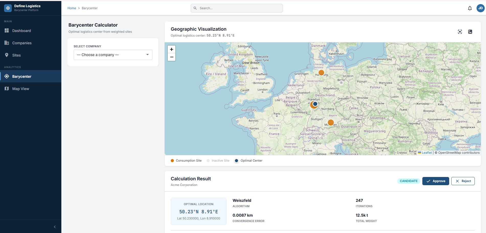
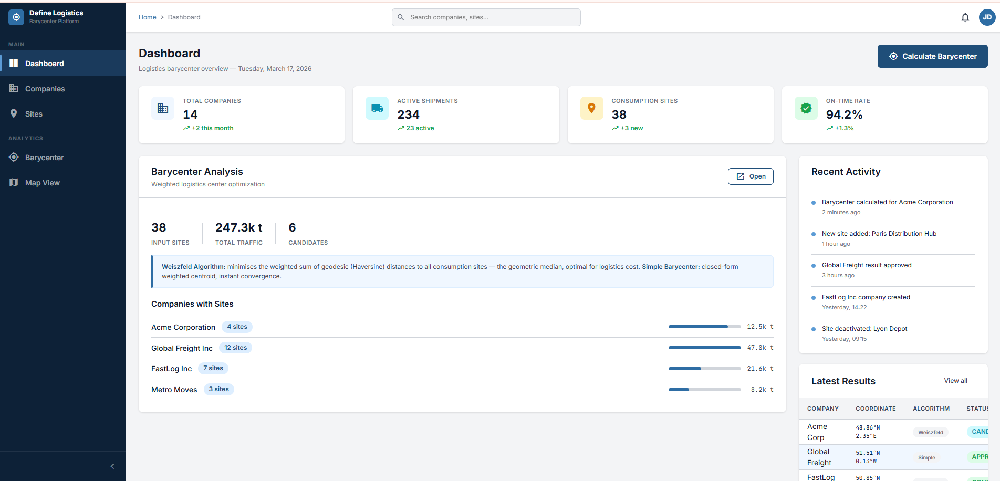
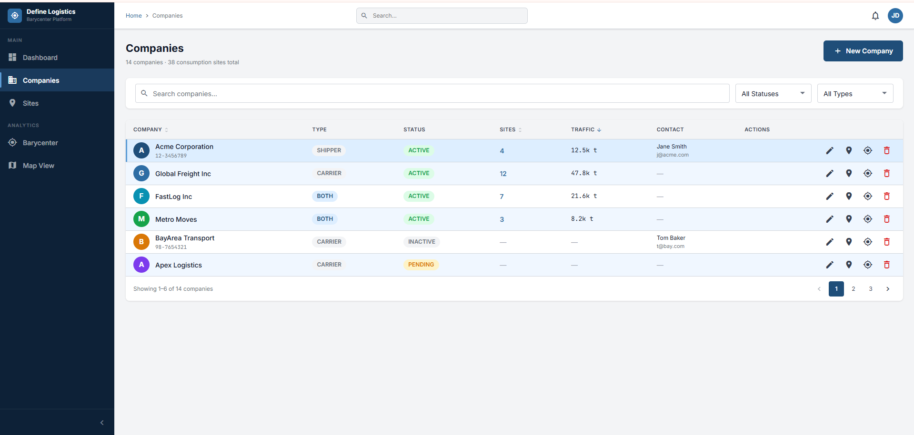
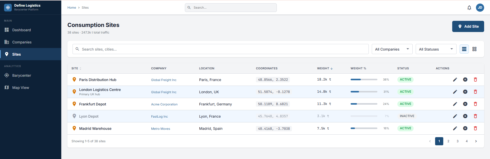

# 🚛 Define Company Logistic Place

A comprehensive logistics platform that calculates optimal barycenter locations for companies and their consumption sites, enabling efficient distribution and cost-effective logistics operations.

[](https://openjdk.java.net/projects/jdk/17/)
[](https://spring.io/projects/spring-boot)
[](https://angular.io/)
[](https://www.docker.com/)
[](https://www.terraform.io/)

## 📋 Table of Contents

- [Overview](#overview)
- [Key Features](#key-features)
- [System Architecture](#system-architecture)
- [Technology Stack](#technology-stack)
- [Platform Screenshots](#platform-screenshots)
- [Quick Start](#quick-start)
- [Development Setup](#development-setup)
- [Deployment](#deployment)
- [API Documentation](#api-documentation)
- [Infrastructure](#infrastructure)
- [Contributing](#contributing)

## 🌟 Overview

The **Define Company Logistic Place** platform is an enterprise-grade solution designed to optimize logistics operations by calculating the mathematical barycenter (center of mass) for companies and their consumption sites. This enables businesses to:

- **Minimize transportation costs** by finding optimal depot locations
- **Reduce delivery times** through strategic positioning
- **Optimize resource allocation** across multiple sites
- **Scale operations efficiently** with data-driven insights

## 🚀 Key Features

### 📊 **Intelligent Barycenter Calculation**
- Advanced algorithms for optimal location determination
- Real-time geographic visualization with Leaflet maps
- Multi-variable optimization considering distance, volume, and costs
- Supports multiple calculation strategies and weighting factors

### 🏢 **Company Management**
- Complete partner company registration and profiling
- Industry classification and business metrics tracking
- Integration with existing ERP and CRM systems
- Role-based access control and permissions

### 📍 **Consumption Sites Management**
- Comprehensive site inventory with geographic coordinates
- Volume and demand forecasting capabilities
- Site-specific metrics and performance tracking
- Batch import/export functionality

### 📈 **Analytics Dashboard**
- Real-time KPI monitoring and reporting
- Cost analysis and ROI calculations
- Performance trend visualization
- Exportable reports and insights

## 🏗️ System Architecture

### **Microservices Architecture**
```
┌─────────────────┐    ┌──────────────────┐    ┌─────────────────┐
│   Angular SPA   │────│   API Gateway    │────│  Load Balancer  │
│    (Port 4200)  │    │   (Port 8080)    │    │                 │
└─────────────────┘    └──────────────────┘    └─────────────────┘
                                │
                ┌───────────────┼───────────────┐
                │               │               │
        ┌───────▼────┐  ┌───────▼────┐  ┌───────▼────┐
        │  Company   │  │    Site    │  │Calculation │
        │  Service   │  │  Service   │  │  Service   │
        │ Port 8081  │  │ Port 8082  │  │ Port 8083  │
        └────────────┘  └────────────┘  └────────────┘
                │               │               │
                └───────────────┼───────────────┘
                                │
                        ┌───────▼────┐
                        │ Dashboard  │
                        │  Service   │
                        │ Port 8084  │
                        └────────────┘
```

### **Infrastructure Services**
- **PostgreSQL**: Multi-database setup for data persistence
- **Redis**: Caching and session management
- **Apache Kafka**: Event streaming and microservices communication
- **Zipkin**: Distributed tracing and monitoring
- **Prometheus + Grafana**: Metrics collection and visualization

## 🛠️ Technology Stack

### **Backend**
- **Java 17** with Spring Boot 3.2.5
- **Spring Cloud** for microservices orchestration
- **Spring Security** for authentication and authorization
- **JPA/Hibernate** for data persistence
- **Maven** for dependency management
- **JUnit 5** with 80% code coverage requirement

### **Frontend**
- **Angular 17.3.0** with TypeScript
- **Leaflet** for interactive mapping
- **RxJS** for reactive programming
- **Angular Material** for UI components
- **Karma + Jasmine** for testing

### **Infrastructure**
- **Docker & Docker Compose** for containerization
- **Terraform** for infrastructure as code
- **AWS ECS/Fargate** for container orchestration
- **GitHub Actions** for CI/CD pipelines
- **Nginx** for reverse proxy and load balancing

### **Monitoring & Observability**
- **Prometheus** for metrics collection
- **Grafana** for visualization dashboards
- **Zipkin** for distributed tracing
- **ELK Stack** for log aggregation

## 📱 Platform Screenshots

### 🎯 Barycenter Calculator
*Advanced geographic calculation engine with real-time visualization*



**Features:**
- Interactive map with geographic visualization using Leaflet
- Real-time barycenter calculation with coordinate display
- Multiple calculation algorithms and optimization strategies
- Export functionality for calculated results
- Distance and cost optimization parameters

---

### 📊 Analytics Dashboard
*Comprehensive KPI monitoring and business intelligence*



**Features:**
- Real-time business metrics and KPI tracking
- Cost analysis with detailed breakdowns (€247.3k shown)
- Performance indicators and trend analysis
- Interactive charts and data visualization
- Customizable reporting periods and filters

---

### 🏢 Partner Companies Management
*Complete company portfolio and relationship management*



**Features:**
- Comprehensive partner company directory
- Industry classification and business metrics
- Contact management and communication tracking
- Performance ratings and status monitoring
- Bulk operations and data export capabilities
- Advanced search and filtering options

---

### 📍 Consumption Sites Registry
*Detailed site management with geographic and operational data*



**Features:**
- Complete consumption site inventory
- Geographic coordinates and mapping integration
- Volume and demand tracking per site
- Status monitoring and operational metrics
- Site-specific analytics and reporting
- Batch import/export functionality for site data

## 🚀 Quick Start

### Prerequisites
```bash
# Required software
Docker >= 20.10
Docker Compose >= 2.0
Java 17
Node.js >= 18
Maven >= 3.8
Git
```

### 1. Clone the Repository
```bash
git clone <repository-url>
cd define-company-logistic-place
```

### 2. Start with Docker Compose
```bash
# Development environment
docker-compose -f docker/docker-compose.yml -f docker/docker-compose.development.yml up -d

# Production environment
docker-compose -f docker/docker-compose.yml -f docker/docker-compose.production.yml up -d
```

### 3. Access the Applications
- **Frontend**: http://localhost:4200
- **API Gateway**: http://localhost:8080
- **Swagger UI**: http://localhost:8080/swagger-ui.html
- **Grafana Dashboard**: http://localhost:3000
- **Prometheus**: http://localhost:9090

## 🔧 Development Setup

### Backend Services
```bash
# Build all microservices
cd microservices
mvn clean package

# Run individual services
cd company-service && mvn spring-boot:run
cd site-service && mvn spring-boot:run
cd calculation-service && mvn spring-boot:run
cd dashboard-service && mvn spring-boot:run
cd api-gateway && mvn spring-boot:run
```

### Frontend Development
```bash
cd src/ui/angular-app
npm install
npm start
# Access at http://localhost:4200
```

### Testing
```bash
# Backend tests (80% coverage required)
mvn test
mvn jacoco:report

# Frontend tests
cd src/ui/angular-app
npm test
```

## 🚀 Deployment

### Docker Deployment
The platform supports multiple deployment scenarios:

- **Development**: `docker-compose.development.yml`
- **Production**: `docker-compose.production.yml`
- **Microservices**: `docker-compose.microservices.yml`
- **Security Hardened**: `docker-compose.security.yml`

### Infrastructure as Code
```bash
# Deploy to AWS using Terraform
cd terraform/environments/prod
terraform init
terraform plan
terraform apply
```

### CI/CD Pipeline
- **GitHub Actions** for automated testing and deployment
- **Multi-environment** support (dev, staging, prod)
- **Blue-green deployment** strategy
- **Automated rollback** capabilities

## 📚 API Documentation

### REST API Endpoints

#### Companies API
```bash
GET    /api/v1/companies           # List all companies
POST   /api/v1/companies           # Create company
GET    /api/v1/companies/{id}      # Get company details
PUT    /api/v1/companies/{id}      # Update company
DELETE /api/v1/companies/{id}      # Delete company
```

#### Sites API
```bash
GET    /api/v1/sites               # List all consumption sites
POST   /api/v1/sites               # Create site
GET    /api/v1/sites/{id}          # Get site details
PUT    /api/v1/sites/{id}          # Update site
DELETE /api/v1/sites/{id}          # Delete site
```

#### Calculation API
```bash
POST   /api/v1/calculations/barycenter    # Calculate optimal location
GET    /api/v1/calculations/{id}          # Get calculation results
GET    /api/v1/calculations/history       # Calculation history
```

#### Dashboard API
```bash
GET    /api/v1/dashboard/metrics    # Get KPI metrics
GET    /api/v1/dashboard/reports    # Generate reports
GET    /api/v1/dashboard/analytics  # Analytics data
```

### API Documentation
- **Swagger UI**: Available at `/swagger-ui.html`
- **OpenAPI 3.0** specification
- **Interactive testing** interface
- **Authentication** required for all endpoints

## 🏗️ Infrastructure

### AWS Architecture
- **ECS Fargate** for serverless containers
- **Application Load Balancer** for traffic distribution
- **RDS PostgreSQL** for data persistence
- **ElastiCache Redis** for caching
- **CloudWatch** for monitoring and logging
- **Route 53** for DNS management
- **CloudFront** for CDN

### Monitoring Stack
- **Prometheus** for metrics collection
- **Grafana** for dashboard visualization
- **Zipkin** for distributed tracing
- **ELK Stack** for centralized logging

### Security Features
- **JWT-based** authentication
- **Role-based** access control (RBAC)
- **HTTPS** enforcement
- **API rate limiting**
- **Input validation** and sanitization
- **SQL injection** protection

## 📈 Performance

### Benchmarks
- **Response Time**: < 200ms for 95th percentile
- **Throughput**: 1000+ requests per second
- **Availability**: 99.9% SLA
- **Scalability**: Auto-scaling based on CPU/memory usage

### Optimization Features
- **Redis caching** for frequently accessed data
- **Database indexing** for optimal query performance
- **CDN integration** for static asset delivery
- **Lazy loading** for frontend components

## 🤝 Contributing

### Development Workflow
1. Fork the repository
2. Create a feature branch (`git checkout -b feature/amazing-feature`)
3. Commit your changes (`git commit -m 'Add amazing feature'`)
4. Push to the branch (`git push origin feature/amazing-feature`)
5. Open a Pull Request

### Code Quality Standards
- **80% test coverage** requirement
- **SonarQube** quality gates
- **ESLint + Prettier** for code formatting
- **Conventional Commits** for commit messages
- **Code review** required for all PRs

### Project Structure
```
define-company-logistic-place/
├── logistics-api/              # Legacy monolithic API
├── microservices/              # Microservices architecture
│   ├── api-gateway/           # API Gateway service
│   ├── company-service/       # Company management
│   ├── site-service/          # Site management
│   ├── calculation-service/   # Barycenter calculations
│   ├── dashboard-service/     # Analytics and reporting
│   └── shared/               # Shared domain models
├── src/ui/angular-app/        # Angular frontend application
├── docker/                    # Docker configuration files
├── terraform/                 # Infrastructure as Code
├── scripts/                   # Build and deployment scripts
├── docs/                      # Project documentation
└── marketing/                 # Marketing materials and screenshots
```

---

## 📞 Support

For questions, issues, or contributions, please:

1. **Check the documentation** in the `/docs` folder
2. **Search existing issues** in the issue tracker
3. **Create a new issue** with detailed information
4. **Contact the development team** for urgent matters

---

**Built with ❤️ by the PRF IT Solutions Team**

*This platform is designed to help logistics operations through intelligent geographic optimization and comprehensive business intelligence.*